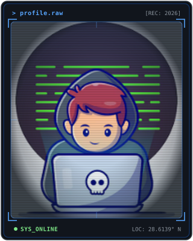
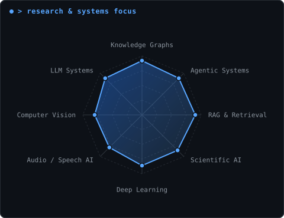
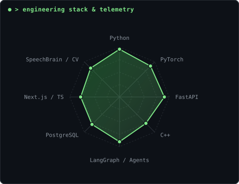

<div align="center">

```
========================================================================================================
[ ravish-kansal@research-terminal ~ ] $ whoami --verbose --status=active
========================================================================================================
```

</div>

<table width="100%" style="background-color: #0D1117; border: 1px solid #30363D; border-radius: 8px;">
  <tr>
    <td width="36%" align="center" valign="middle" style="background-color: #0D1117; border-right: 1px solid #30363D; padding: 24px 16px;">
      <a href="https://github.com/ravishkansal22">
        
      </a>
    </td>
    <td width="64%" valign="top" style="background-color: #0D1117; padding: 24px 28px;">
      <div style="font-family: 'Fira Code', 'Source Code Pro', monospace; color: #58A6FF; font-size: 13px; font-weight: bold; margin-bottom: 6px;">
        &gt; whoami
      </div>
      <h1 style="font-family: -apple-system, BlinkMacSystemFont, 'Segoe UI', Helvetica, Arial, sans-serif; font-size: 28px; font-weight: 800; color: #FFFFFF; margin: 0 0 6px 0; letter-spacing: -0.5px; border: none; padding: 0;">
        Ravish Kansal
      </h1>
      <div style="font-family: 'Fira Code', 'Source Code Pro', monospace; color: #7EE787; font-size: 13px; font-weight: 600; margin-bottom: 12px;">
        [AI/ML Engineer * Researcher * Systems Builder] &lt;sys/online&gt;
      </div>
      <div style="font-family: -apple-system, BlinkMacSystemFont, 'Segoe UI', Helvetica, Arial, sans-serif; color: #8B949E; font-size: 13.5px; margin-bottom: 16px; line-height: 1.55;">
        Building AI systems at the intersection of machine learning, agentic architectures, and scientific discovery.
      </div>
      <div style="font-family: 'Fira Code', 'Source Code Pro', monospace; color: #C9D1D9; font-size: 12px; line-height: 1.85;">
        <div>* <b>Location:</b> Delhi/NCR, India</div>
        <div>* <b>Education:</b> Delhi Technological University (DTU) - B.Tech (ME)</div>
        <div>* <b>Core Domain:</b> AI/ML, LLM Systems, Agentic AI, Scientific Knowledge Graphs</div>
        <div>* <b>Primary Focus:</b> ResearchGraph, Deep Learning Systems, Audio AI</div>
      </div>
      <div style="margin-top: 18px; border-top: 1px dashed #30363D; padding-top: 14px;">
        <div style="font-family: 'Fira Code', monospace; color: #8B949E; font-size: 11px; font-weight: bold; margin-bottom: 10px; letter-spacing: 1px;">
          ACTIVE STACK
        </div>
        <div>
          
          
          
          
          
          
          
        </div>
      </div>
      <div style="margin-top: 16px; font-family: 'Fira Code', monospace; font-size: 11px; color: #8B949E;">
        <code>[&gt;_] core</code> &nbsp;|&nbsp; <code>[/] projects</code> &nbsp;|&nbsp; <code>[@] mail</code> &nbsp;|&nbsp; <a href="https://github.com/ravishkansal22" style="color: #58A6FF; text-decoration: none;">github.com/ravishkansal22</a>
      </div>
    </td>
  </tr>
</table>

<br/>

### ~/ experience

<table width="100%" style="background-color: #0D1117; border: 1px solid #30363D; border-radius: 8px;">
  <tr>
    <td style="background-color: #0D1117; padding: 22px 26px;">
      <div style="font-family: 'Fira Code', monospace; font-size: 11.5px; color: #8B949E; margin-bottom: 12px;">
        <span style="color: #58A6FF; font-weight: bold;">&gt; role.exe --status=active</span>
        &nbsp;&nbsp;&nbsp;&nbsp;&bull;&nbsp;&nbsp;&nbsp;&nbsp;
        <span style="color: #7EE787; font-weight: 600;">● ACTIVE · 2026</span>
      </div>
      
      <h2 style="font-family: -apple-system, BlinkMacSystemFont, 'Segoe UI', Helvetica, Arial, sans-serif; font-size: 24px; font-weight: 800; color: #FFFFFF; margin: 4px 0 4px 0; letter-spacing: -0.3px; border: none; padding: 0;">
        SDET INTERN
      </h2>
      
      <div style="font-family: 'Fira Code', monospace; font-size: 14.5px; font-weight: 600; color: #58A6FF; margin-bottom: 4px;">
        Autoload AI Systems Pvt. Ltd.
      </div>

      <div style="font-family: -apple-system, BlinkMacSystemFont, 'Segoe UI', Helvetica, Arial, sans-serif; font-size: 12.5px; color: #8B949E; margin-bottom: 14px;">
        Software Engineering · Test Automation · System Reliability
      </div>

      <div style="font-family: -apple-system, BlinkMacSystemFont, 'Segoe UI', Helvetica, Arial, sans-serif; font-size: 13px; color: #C9D1D9; line-height: 1.6; margin: 12px 0 16px 0;">
        Software testing, automation, performance scripting, and software reliability/scalability.
      </div>

      <div>
        
        
        
        
      </div>
    </td>
  </tr>
</table>

<br/>

### ~/ research

<table width="100%" style="border-collapse: separate; border-spacing: 14px; background-color: transparent;">
  <tr>
    <td width="33.3%" valign="top" style="background-color: #0D1117; border: 1px solid #30363D; border-radius: 8px; padding: 20px 18px;">
      <div style="font-family: 'Fira Code', monospace; font-size: 11px; color: #58A6FF; font-weight: bold; margin-bottom: 4px;">01 / KNOWLEDGE REPRESENTATION</div>
      <div style="font-family: 'Fira Code', monospace; font-size: 14px; font-weight: bold; color: #FFFFFF; margin-bottom: 8px;">RESEARCH GRAPHS</div>
      <div style="font-family: -apple-system, BlinkMacSystemFont, 'Segoe UI', Helvetica, Arial, sans-serif; font-size: 12.5px; color: #C9D1D9; line-height: 1.55;">
        Building systems that extract scientific knowledge and relationships from literature into queryable research graphs.
      </div>
    </td>
    <td width="33.3%" valign="top" style="background-color: #0D1117; border: 1px solid #30363D; border-radius: 8px; padding: 20px 18px;">
      <div style="font-family: 'Fira Code', monospace; font-size: 11px; color: #7EE787; font-weight: bold; margin-bottom: 4px;">02 / REASONING &amp; RETRIEVAL</div>
      <div style="font-family: 'Fira Code', monospace; font-size: 14px; font-weight: bold; color: #FFFFFF; margin-bottom: 8px;">AGENTIC AI &amp; RAG</div>
      <div style="font-family: -apple-system, BlinkMacSystemFont, 'Segoe UI', Helvetica, Arial, sans-serif; font-size: 12.5px; color: #C9D1D9; line-height: 1.55;">
        Building retrieval and agentic systems for reasoning over large document collections.
      </div>
    </td>
    <td width="33.3%" valign="top" style="background-color: #0D1117; border: 1px solid #30363D; border-radius: 8px; padding: 20px 18px;">
      <div style="font-family: 'Fira Code', monospace; font-size: 11px; color: #F0883E; font-weight: bold; margin-bottom: 4px;">03 / MULTIMODAL SYSTEMS</div>
      <div style="font-family: 'Fira Code', monospace; font-size: 14px; font-weight: bold; color: #FFFFFF; margin-bottom: 8px;">MULTIMODAL &amp; AUDIO AI</div>
      <div style="font-family: -apple-system, BlinkMacSystemFont, 'Segoe UI', Helvetica, Arial, sans-serif; font-size: 12.5px; color: #C9D1D9; line-height: 1.55;">
        Exploring deep-learning systems for speech separation and multimodal human-computer interaction.
      </div>
    </td>
  </tr>
</table>

<br/>

### ~/ selected-work

<table width="100%" style="border-collapse: separate; border-spacing: 14px; background-color: transparent;">
  <tr>
    <td width="50%" valign="top" style="background-color: #0D1117; border: 1px solid #30363D; border-radius: 8px; padding: 20px 22px;">
      <div style="font-family: 'Fira Code', monospace; font-size: 11px; color: #8B949E; letter-spacing: 0.5px;">RESEARCH / ACTIVE</div>
      <div style="font-family: 'Fira Code', monospace; font-size: 16px; font-weight: bold; color: #58A6FF; margin: 8px 0 10px 0;">
        <a href="https://github.com/ravishkansal22" style="color: #58A6FF; text-decoration: none;">ResearchGraph</a>
      </div>
      <div style="font-family: -apple-system, BlinkMacSystemFont, 'Segoe UI', Helvetica, Arial, sans-serif; font-size: 12.5px; color: #C9D1D9; margin-bottom: 14px; line-height: 1.55; min-height: 56px;">
        Scientific literature intelligence system focused on document processing, scientific information extraction, knowledge representation, research graph construction, discovery, and hypothesis generation.
      </div>
      <div style="margin-bottom: 12px;">
        <code>Research</code> · <code>Knowledge Graphs</code> · <code>RAG</code> · <code>Scientific AI</code>
      </div>
      <div style="font-family: 'Fira Code', monospace; font-size: 11px; color: #7EE787;">
        -&gt; Long-term research project
      </div>
    </td>
    <td width="50%" valign="top" style="background-color: #0D1117; border: 1px solid #30363D; border-radius: 8px; padding: 20px 22px;">
      <div style="font-family: 'Fira Code', monospace; font-size: 11px; color: #8B949E; letter-spacing: 0.5px;">CIVIC-TECH / HACKATHON</div>
      <div style="font-family: 'Fira Code', monospace; font-size: 16px; font-weight: bold; color: #58A6FF; margin: 8px 0 10px 0;">
        <a href="https://github.com/ravishkansal22" style="color: #58A6FF; text-decoration: none;">Nagrik</a>
      </div>
      <div style="font-family: -apple-system, BlinkMacSystemFont, 'Segoe UI', Helvetica, Arial, sans-serif; font-size: 12.5px; color: #C9D1D9; margin-bottom: 14px; line-height: 1.55; min-height: 56px;">
        AI-powered civic platform for scheme discovery, voice-assisted form filling, grievance workflows, and government decision intelligence.
      </div>
      <div style="margin-bottom: 12px;">
        <code>AI Agents</code> · <code>RAG</code> · <code>Voice AI</code> · <code>CivicTech</code>
      </div>
      <div style="font-family: 'Fira Code', monospace; font-size: 11px; color: #D29922;">
        -&gt; SIH Decode - Second Runner-Up
      </div>
    </td>
  </tr>
  <tr>
    <td width="50%" valign="top" style="background-color: #0D1117; border: 1px solid #30363D; border-radius: 8px; padding: 20px 22px;">
      <div style="font-family: 'Fira Code', monospace; font-size: 11px; color: #8B949E; letter-spacing: 0.5px;">AUDIO AI / DEEP LEARNING</div>
      <div style="font-family: 'Fira Code', monospace; font-size: 16px; font-weight: bold; color: #58A6FF; margin: 8px 0 10px 0;">
        <a href="https://github.com/ravishkansal22" style="color: #58A6FF; text-decoration: none;">Sonic Split</a>
      </div>
      <div style="font-family: -apple-system, BlinkMacSystemFont, 'Segoe UI', Helvetica, Arial, sans-serif; font-size: 12.5px; color: #C9D1D9; margin-bottom: 14px; line-height: 1.55; min-height: 56px;">
        Multi-speaker audio separation research using SpeechBrain, SepFormer and TF-Locoformer, with an Adaptive Audio Preprocessing Engine.
      </div>
      <div style="margin-bottom: 12px;">
        <code>PyTorch</code> · <code>Speech Separation</code> · <code>SepFormer</code> · <code>Audio AI</code>
      </div>
      <div style="font-family: 'Fira Code', monospace; font-size: 11px; color: #8B949E;">
        -&gt; Audio preprocessing + model research
      </div>
    </td>
    <td width="50%" valign="top" style="background-color: #0D1117; border: 1px solid #30363D; border-radius: 8px; padding: 20px 22px;">
      <div style="font-family: 'Fira Code', monospace; font-size: 11px; color: #8B949E; letter-spacing: 0.5px;">HEALTHCARE AI / PROTOTYPE</div>
      <div style="font-family: 'Fira Code', monospace; font-size: 16px; font-weight: bold; color: #58A6FF; margin: 8px 0 10px 0;">
        <a href="https://github.com/ravishkansal22" style="color: #58A6FF; text-decoration: none;">Arogya OS</a>
      </div>
      <div style="font-family: -apple-system, BlinkMacSystemFont, 'Segoe UI', Helvetica, Arial, sans-serif; font-size: 12.5px; color: #C9D1D9; margin-bottom: 14px; line-height: 1.55; min-height: 56px;">
        AI healthcare operating-system concept exploring health memory, health twins, report interpretation, voice workflows and queue intelligence.
      </div>
      <div style="margin-bottom: 12px;">
        <code>AI Agents</code> · <code>Healthcare AI</code> · <code>RAG</code> · <code>FastAPI</code>
      </div>
      <div style="font-family: 'Fira Code', monospace; font-size: 11px; color: #8B949E;">
        -&gt; Architecture concept + prototype
      </div>
    </td>
  </tr>
  <tr>
    <td width="50%" valign="top" style="background-color: #0D1117; border: 1px solid #30363D; border-radius: 8px; padding: 20px 22px;">
      <div style="font-family: 'Fira Code', monospace; font-size: 11px; color: #8B949E; letter-spacing: 0.5px;">COMPUTER VISION / SYSTEMS</div>
      <div style="font-family: 'Fira Code', monospace; font-size: 16px; font-weight: bold; color: #58A6FF; margin: 8px 0 10px 0;">
        <a href="https://github.com/ravishkansal22/GestureOS" style="color: #58A6FF; text-decoration: none;">GestureOS / Zesture</a>
      </div>
      <div style="font-family: -apple-system, BlinkMacSystemFont, 'Segoe UI', Helvetica, Arial, sans-serif; font-size: 12.5px; color: #C9D1D9; margin-bottom: 14px; line-height: 1.55; min-height: 56px;">
        Gesture-controlled OS interface using MediaPipe, OpenCV and TensorFlow/Keras with real-time camera inference.
      </div>
      <div style="margin-bottom: 12px;">
        <code>Computer Vision</code> · <code>MediaPipe</code> · <code>OpenCV</code> · <code>TensorFlow</code>
      </div>
      <div style="font-family: 'Fira Code', monospace; font-size: 11px; color: #8B949E;">
        -&gt; Real-time vision system
      </div>
    </td>
    <td width="50%" valign="top" style="background-color: #0D1117; border: 1px solid #30363D; border-radius: 8px; padding: 20px 22px;">
      <div style="font-family: 'Fira Code', monospace; font-size: 11px; color: #8B949E; letter-spacing: 0.5px;">AGENTIC SYSTEMS / BACKEND</div>
      <div style="font-family: 'Fira Code', monospace; font-size: 16px; font-weight: bold; color: #58A6FF; margin: 8px 0 10px 0;">
        <a href="https://github.com/ravishkansal22" style="color: #58A6FF; text-decoration: none;">OptiFlow</a>
      </div>
      <div style="font-family: -apple-system, BlinkMacSystemFont, 'Segoe UI', Helvetica, Arial, sans-serif; font-size: 12.5px; color: #C9D1D9; margin-bottom: 14px; line-height: 1.55; min-height: 56px;">
        Agentic logistics intelligence system for dispatch optimization, route analysis and operational decision support.
      </div>
      <div style="margin-bottom: 12px;">
        <code>Python</code> · <code>FastAPI</code> · <code>AI Agents</code> · <code>Optimization</code>
      </div>
      <div style="font-family: 'Fira Code', monospace; font-size: 11px; color: #8B949E;">
        -&gt; Agentic logistics intelligence
      </div>
    </td>
  </tr>
</table>

<br/>

### ~/ stack

<table width="100%" style="background-color: transparent; border: none;">
  <tr>
    <td width="50%" align="center" style="border: none; padding: 6px;">
      
    </td>
    <td width="50%" align="center" style="border: none; padding: 6px;">
      
    </td>
  </tr>
</table>

<div align="center" style="font-family: 'Fira Code', monospace; font-size: 11px; color: #8B949E; margin-top: 6px;">
  <code>left: research &amp; systems vectors * right: active engineering stack &amp; telemetry.</code>
</div>

<br/>

<table width="100%" style="background-color: #0D1117; border: 1px solid #30363D; border-radius: 8px;">
  <tr>
    <td style="padding: 16px 20px; font-family: 'Fira Code', monospace; font-size: 12px; color: #C9D1D9; line-height: 1.8;">
      <div><b style="color: #58A6FF;">LANGUAGES:</b> Python, C++, JavaScript, TypeScript, SQL</div>
      <div><b style="color: #7EE787;">AI / ML:</b> PyTorch, TensorFlow, Scikit-learn, Computer Vision (OpenCV, MediaPipe), NLP, Speech Separation (SpeechBrain, SepFormer)</div>
      <div><b style="color: #58A6FF;">AI SYSTEMS / LLM:</b> RAG, LangChain, LangGraph, Agentic AI, Embeddings, ChromaDB, Knowledge Graph Modeling</div>
      <div><b style="color: #F0883E;">BACKEND &amp; DB:</b> FastAPI, Python APIs, PostgreSQL, SQLAlchemy, Alembic</div>
      <div><b style="color: #8B949E;">FRONTEND &amp; TOOLS:</b> Next.js, React, Git, GitHub, Jupyter, Hugging Face, Supabase</div>
    </td>
  </tr>
</table>

<br/>

### ~/ open-questions

```text
01 - How can an AI system construct a continuously evolving graph of scientific knowledge from literature?
02 - Can research gaps be detected systematically rather than through manual literature review?
03 - How can negative results and dead ends be represented as first-class scientific knowledge?
04 - Can agentic systems perform reliable deep research without simply generating plausible text?
05 - How can multimodal scientific evidence be represented in a machine-readable knowledge system?
06 - How do we evaluate whether an AI-generated research hypothesis is actually novel?
```

<br/>

### ~/ comms

<table width="100%" style="background-color: #0D1117; border: 1px solid #30363D; border-radius: 8px; padding: 14px;">
  <tr>
    <td align="center" style="font-family: 'Fira Code', monospace; font-size: 12px; color: #8B949E;">
      <a href="https://github.com/ravishkansal22" style="color: #58A6FF; text-decoration: none;">[ github.com/ravishkansal22 ]</a>
      &nbsp;&nbsp;&bull;&nbsp;&nbsp;
      <a href="https://www.linkedin.com/in/ravish-kansal-7a86b4376/" style="color: #58A6FF; text-decoration: none;">[ linkedin.com/in/ravish-kansal ]</a>
      &nbsp;&nbsp;&bull;&nbsp;&nbsp;
      <a href="mailto:ravishkansalrk22@gmail.com" style="color: #58A6FF; text-decoration: none;">[ email: ravishkansalrk22@gmail.com ]</a>
    </td>
  </tr>
</table>
