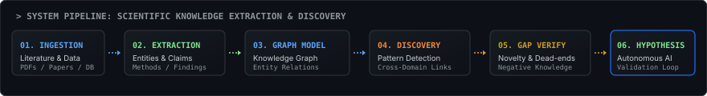

<div align="center">

```
========================================================================================================
[ ravish-kansal@research-terminal ~ ] $ whoami --verbose --status=active
========================================================================================================
```

</div>

<table width="100%" style="background-color: #0D1117; border: 1px solid #30363D; border-radius: 8px;">
  <tr>
    <td width="36%" align="center" valign="middle" style="background-color: #0D1117; border-right: 1px solid #30363D; padding: 16px;">
      <a href="https://github.com/ravishkansal22">
        
      </a>
    </td>
    <td width="64%" valign="top" style="background-color: #0D1117; padding: 20px;">
      <div style="font-family: 'Fira Code', 'Source Code Pro', monospace; color: #58A6FF; font-size: 13px; font-weight: bold; margin-bottom: 6px;">
        &gt; whoami
      </div>
      <h1 style="font-family: -apple-system, BlinkMacSystemFont, 'Segoe UI', Helvetica, Arial, sans-serif; font-size: 28px; font-weight: 800; color: #FFFFFF; margin: 2px 0 6px 0; letter-spacing: -0.5px;">
        Ravish Kansal
      </h1>
      <div style="font-family: 'Fira Code', 'Source Code Pro', monospace; color: #7EE787; font-size: 13px; font-weight: 600; margin-bottom: 12px;">
        [AI/ML Engineer * Researcher * Systems Builder] &lt;sys/online&gt;
      </div>
      <div style="font-family: -apple-system, BlinkMacSystemFont, 'Segoe UI', Helvetica, Arial, sans-serif; color: #8B949E; font-size: 13px; margin-bottom: 14px; line-height: 1.5;">
        Building AI systems at the intersection of machine learning, agentic architectures, and scientific discovery.
      </div>
      <div style="font-family: 'Fira Code', 'Source Code Pro', monospace; color: #C9D1D9; font-size: 12px; line-height: 1.8;">
        <div>* <b>Location:</b> Delhi/NCR, India</div>
        <div>* <b>Education:</b> Delhi Technological University (DTU) - B.Tech (ME)</div>
        <div>* <b>Core Domain:</b> AI/ML, LLM Systems, Agentic AI, Scientific Knowledge Graphs</div>
        <div>* <b>Primary Focus:</b> ResearchGraph, Deep Learning Systems, Audio AI</div>
      </div>
      <div style="margin-top: 14px; border-top: 1px dashed #30363D; padding-top: 12px;">
        <div style="font-family: 'Fira Code', monospace; color: #8B949E; font-size: 11px; font-weight: bold; margin-bottom: 8px; letter-spacing: 1px;">
          ACTIVE STACK
        </div>
        <div>
          
          
          
          
          
          
          
        </div>
        <div style="font-family: 'Fira Code', monospace; color: #8B949E; font-size: 10px; margin-top: 6px;">
          * blue indicator = active production / research toolchain
        </div>
      </div>
      <div style="margin-top: 14px; font-family: 'Fira Code', monospace; font-size: 11px; color: #8B949E;">
        <code>[&gt;_] core</code> &nbsp;|&nbsp; <code>[/] projects</code> &nbsp;|&nbsp; <code>[@] mail</code> &nbsp;|&nbsp; <a href="https://github.com/ravishkansal22" style="color: #58A6FF; text-decoration: none;">github.com/ravishkansal22</a>
      </div>
    </td>
  </tr>
</table>

<br/>

### ~/ research

```
[ ARCHITECTURE VISION ]
Moving beyond standalone LLM wrappers toward autonomous AI systems capable of structured reasoning:
scientific literature -> document extraction -> knowledge representation -> graph synthesis -> discovery -> gap/novelty verification -> hypothesis generation
```

<div align="center">
  
</div>

<br/>

<table width="100%" style="border-collapse: separate; border-spacing: 12px; background-color: transparent;">
  <tr>
    <td width="33.3%" valign="top" style="background-color: #0D1117; border: 1px solid #30363D; border-radius: 8px; padding: 14px;">
      <div style="font-family: 'Fira Code', monospace; font-size: 11px; color: #58A6FF; font-weight: bold;">01. RESEARCH GRAPHS</div>
      <div style="font-family: -apple-system, BlinkMacSystemFont, 'Segoe UI', Helvetica, Arial, sans-serif; font-size: 12px; color: #C9D1D9; margin-top: 8px; line-height: 1.5;">
        Extracting structured entities, claims, and methodologies from scientific literature to construct dynamic, queryable knowledge graphs for literature synthesis.
      </div>
    </td>
    <td width="33.3%" valign="top" style="background-color: #0D1117; border: 1px solid #30363D; border-radius: 8px; padding: 14px;">
      <div style="font-family: 'Fira Code', monospace; font-size: 11px; color: #7EE787; font-weight: bold;">02. AGENTIC AI &amp; RAG</div>
      <div style="font-family: -apple-system, BlinkMacSystemFont, 'Segoe UI', Helvetica, Arial, sans-serif; font-size: 12px; color: #C9D1D9; margin-top: 8px; line-height: 1.5;">
        Designing multi-agent workflows, tool-augmented reasoning loops, and contextual retrieval engines that operate across massive document corpora.
      </div>
    </td>
    <td width="33.3%" valign="top" style="background-color: #0D1117; border: 1px solid #30363D; border-radius: 8px; padding: 14px;">
      <div style="font-family: 'Fira Code', monospace; font-size: 11px; color: #F0883E; font-weight: bold;">03. MULTIMODAL &amp; AUDIO AI</div>
      <div style="font-family: -apple-system, BlinkMacSystemFont, 'Segoe UI', Helvetica, Arial, sans-serif; font-size: 12px; color: #C9D1D9; margin-top: 8px; line-height: 1.5;">
        Investigating deep learning speech separation (SpeechBrain, SepFormer, TF-Locoformer) and multimodal interfaces for real-time human-computer interaction.
      </div>
    </td>
  </tr>
</table>

<br/>

### Experience

| Role | Company | Timeline | Focus |
| :--- | :--- | :--- | :--- |
| **SDET Intern** | Autoload AI Systems Pvt. Ltd. | 2026 | Software testing, automated test harness development, performance scripting, and system reliability/scalability. |
| **AI/ML Intern** | Veracy Consulting | 2026 | Data preprocessing, exploratory data analysis (EDA), supervised and unsupervised learning, ML model development and evaluation. |

<br/>

### ~/ achievements

<table width="100%" style="border-collapse: separate; border-spacing: 12px; background-color: transparent;">
  <tr>
    <td width="50%" valign="top" style="background-color: #0D1117; border: 1px solid #30363D; border-radius: 8px; padding: 14px;">
      <div style="font-family: 'Fira Code', monospace; font-size: 11px; color: #D29922; font-weight: bold;">RUNNER-UP / 2ND PLACE</div>
      <div style="font-family: 'Fira Code', monospace; font-size: 14px; font-weight: bold; color: #58A6FF; margin: 4px 0;">
        Kriti Hackathon (BITS Pilani)
      </div>
      <div style="font-family: -apple-system, BlinkMacSystemFont, 'Segoe UI', Helvetica, Arial, sans-serif; font-size: 12px; color: #C9D1D9; line-height: 1.5;">
        Competed against 750+ teams. Developed <b>Mandi Quant</b>, a quantitative agritech platform for market transparency and commodity price modeling.
      </div>
    </td>
    <td width="50%" valign="top" style="background-color: #0D1117; border: 1px solid #30363D; border-radius: 8px; padding: 14px;">
      <div style="font-family: 'Fira Code', monospace; font-size: 11px; color: #D29922; font-weight: bold;">SECOND RUNNER-UP</div>
      <div style="font-family: 'Fira Code', monospace; font-size: 14px; font-weight: bold; color: #58A6FF; margin: 4px 0;">
        SIH Decode - Render Track
      </div>
      <div style="font-family: -apple-system, BlinkMacSystemFont, 'Segoe UI', Helvetica, Arial, sans-serif; font-size: 12px; color: #C9D1D9; line-height: 1.5;">
        Team Nagrik. Engineered <b>Nagrik</b> (AI Digital Citizen Companion), an agentic civic platform providing voice-based form filling and scheme intelligence.
      </div>
    </td>
  </tr>
</table>

<br/>

### ~/ selected work

<table width="100%" style="border-collapse: separate; border-spacing: 12px; background-color: transparent;">
  <tr>
    <td width="50%" valign="top" style="background-color: #0D1117; border: 1px solid #30363D; border-radius: 8px; padding: 14px;">
      <div style="font-family: 'Fira Code', monospace; font-size: 11px; color: #8B949E;">research / active</div>
      <div style="font-family: 'Fira Code', monospace; font-size: 15px; font-weight: bold; color: #58A6FF; margin: 4px 0;">
        <a href="https://github.com/ravishkansal22" style="color: #58A6FF; text-decoration: none;">ResearchGraph</a>
      </div>
      <div style="font-family: -apple-system, BlinkMacSystemFont, 'Segoe UI', Helvetica, Arial, sans-serif; font-size: 12px; color: #C9D1D9; margin: 6px 0 10px 0; min-height: 48px; line-height: 1.45;">
        End-to-end scientific literature intelligence platform: document processing, scientific information extraction, knowledge graph construction, discovery verification, and hypothesis generation.
      </div>
      <div style="margin-bottom: 10px;">
        <code>Research</code> <code>Knowledge Graphs</code> <code>RAG</code> <code>LLM</code> <code>Scientific AI</code>
      </div>
      <div style="font-family: 'Fira Code', monospace; font-size: 11px; color: #8B949E;">
        * core long-term research project
      </div>
    </td>
    <td width="50%" valign="top" style="background-color: #0D1117; border: 1px solid #30363D; border-radius: 8px; padding: 14px;">
      <div style="font-family: 'Fira Code', monospace; font-size: 11px; color: #8B949E;">civic-tech / hackathon award</div>
      <div style="font-family: 'Fira Code', monospace; font-size: 15px; font-weight: bold; color: #58A6FF; margin: 4px 0;">
        <a href="https://github.com/ravishkansal22" style="color: #58A6FF; text-decoration: none;">Nagrik (AI Citizen Companion)</a>
      </div>
      <div style="font-family: -apple-system, BlinkMacSystemFont, 'Segoe UI', Helvetica, Arial, sans-serif; font-size: 12px; color: #C9D1D9; margin: 6px 0 10px 0; min-height: 48px; line-height: 1.45;">
        AI-powered civic platform assisting citizens with scheme discovery, voice-assisted form filling, grievance resolution, and government-side decision intelligence. (SIH Decode 2nd Runner-Up).
      </div>
      <div style="margin-bottom: 10px;">
        <code>Next.js</code> <code>AI Agents</code> <code>RAG</code> <code>Voice AI</code> <code>CivicTech</code>
      </div>
      <div style="font-family: 'Fira Code', monospace; font-size: 11px; color: #8B949E;">
        * SIH Decode Second Runner-Up
      </div>
    </td>
  </tr>
  <tr>
    <td width="50%" valign="top" style="background-color: #0D1117; border: 1px solid #30363D; border-radius: 8px; padding: 14px;">
      <div style="font-family: 'Fira Code', monospace; font-size: 11px; color: #8B949E;">audio-ai / deep learning</div>
      <div style="font-family: 'Fira Code', monospace; font-size: 15px; font-weight: bold; color: #58A6FF; margin: 4px 0;">
        <a href="https://github.com/ravishkansal22" style="color: #58A6FF; text-decoration: none;">Sonic Split</a>
      </div>
      <div style="font-family: -apple-system, BlinkMacSystemFont, 'Segoe UI', Helvetica, Arial, sans-serif; font-size: 12px; color: #C9D1D9; margin: 6px 0 10px 0; min-height: 48px; line-height: 1.45;">
        Multi-speaker audio separation architecture utilizing SpeechBrain, SepFormer, and TF-Locoformer models with an Adaptive Audio Preprocessing Engine (AAPE) for normalization and VAD.
      </div>
      <div style="margin-bottom: 10px;">
        <code>PyTorch</code> <code>Speech Separation</code> <code>Audio AI</code> <code>SepFormer</code>
      </div>
      <div style="font-family: 'Fira Code', monospace; font-size: 11px; color: #8B949E;">
        * audio preprocessing &amp; model research
      </div>
    </td>
    <td width="50%" valign="top" style="background-color: #0D1117; border: 1px solid #30363D; border-radius: 8px; padding: 14px;">
      <div style="font-family: 'Fira Code', monospace; font-size: 11px; color: #8B949E;">healthcare / prototype</div>
      <div style="font-family: 'Fira Code', monospace; font-size: 15px; font-weight: bold; color: #58A6FF; margin: 4px 0;">
        <a href="https://github.com/ravishkansal22" style="color: #58A6FF; text-decoration: none;">Arogya OS</a>
      </div>
      <div style="font-family: -apple-system, BlinkMacSystemFont, 'Segoe UI', Helvetica, Arial, sans-serif; font-size: 12px; color: #C9D1D9; margin: 6px 0 10px 0; min-height: 48px; line-height: 1.45;">
        AI healthcare OS concept prototyping lifelong health memory, health twin simulation, voice-to-documentation clinical workflows, report interpretation, and queue intelligence.
      </div>
      <div style="margin-bottom: 10px;">
        <code>AI Agents</code> <code>Healthcare AI</code> <code>RAG</code> <code>FastAPI</code>
      </div>
      <div style="font-family: 'Fira Code', monospace; font-size: 11px; color: #8B949E;">
        * architectural concept &amp; prototype
      </div>
    </td>
  </tr>
  <tr>
    <td width="50%" valign="top" style="background-color: #0D1117; border: 1px solid #30363D; border-radius: 8px; padding: 14px;">
      <div style="font-family: 'Fira Code', monospace; font-size: 11px; color: #8B949E;">computer-vision / systems</div>
      <div style="font-family: 'Fira Code', monospace; font-size: 15px; font-weight: bold; color: #58A6FF; margin: 4px 0;">
        <a href="https://github.com/ravishkansal22/GestureOS" style="color: #58A6FF; text-decoration: none;">GestureOS / Zesture</a>
      </div>
      <div style="font-family: -apple-system, BlinkMacSystemFont, 'Segoe UI', Helvetica, Arial, sans-serif; font-size: 12px; color: #C9D1D9; margin: 6px 0 10px 0; min-height: 48px; line-height: 1.45;">
        Real-time gesture-controlled OS interface powered by MediaPipe and custom TensorFlow/Keras gesture classification models, streaming camera feeds via FastAPI backend.
      </div>
      <div style="margin-bottom: 10px;">
        <code>Computer Vision</code> <code>MediaPipe</code> <code>OpenCV</code> <code>TensorFlow</code> <code>FastAPI</code>
      </div>
      <div style="font-family: 'Fira Code', monospace; font-size: 11px; color: #8B949E;">
        * real-time vision inference
      </div>
    </td>
    <td width="50%" valign="top" style="background-color: #0D1117; border: 1px solid #30363D; border-radius: 8px; padding: 14px;">
      <div style="font-family: 'Fira Code', monospace; font-size: 11px; color: #8B949E;">agentic-systems / backend</div>
      <div style="font-family: 'Fira Code', monospace; font-size: 15px; font-weight: bold; color: #58A6FF; margin: 4px 0;">
        <a href="https://github.com/ravishkansal22" style="color: #58A6FF; text-decoration: none;">OptiFlow</a>
      </div>
      <div style="font-family: -apple-system, BlinkMacSystemFont, 'Segoe UI', Helvetica, Arial, sans-serif; font-size: 12px; color: #C9D1D9; margin: 6px 0 10px 0; min-height: 48px; line-height: 1.45;">
        Agentic logistics network intelligence engine providing automated dispatch optimization, multi-agent route analysis, and operational decision backend APIs.
      </div>
      <div style="margin-bottom: 10px;">
        <code>Python</code> <code>FastAPI</code> <code>AI Agents</code> <code>Optimization</code>
      </div>
      <div style="font-family: 'Fira Code', monospace; font-size: 11px; color: #8B949E;">
        * agentic logistics intelligence
      </div>
    </td>
  </tr>
</table>

<br/>

### ~/ skill radar

<table width="100%" style="background-color: transparent; border: none;">
  <tr>
    <td width="50%" align="center" style="border: none; padding: 4px;">
      
    </td>
    <td width="50%" align="center" style="border: none; padding: 4px;">
      
    </td>
  </tr>
</table>

<div align="center" style="font-family: 'Fira Code', monospace; font-size: 11px; color: #8B949E; margin-top: 4px;">
  <code>left: research &amp; systems vectors * right: active engineering stack &amp; telemetry.</code>
</div>

<br/>

<table width="100%" style="background-color: #0D1117; border: 1px solid #30363D; border-radius: 8px; padding: 14px;">
  <tr>
    <td style="padding: 10px; font-family: 'Fira Code', monospace; font-size: 12px; color: #C9D1D9;">
      <div><b style="color: #58A6FF;">LANGUAGES:</b> Python, C++, JavaScript, TypeScript, SQL</div>
      <div style="margin-top: 6px;"><b style="color: #7EE787;">AI / ML:</b> PyTorch, TensorFlow, Scikit-learn, Computer Vision (OpenCV, MediaPipe), NLP, Speech Separation (SpeechBrain, SepFormer)</div>
      <div style="margin-top: 6px;"><b style="color: #58A6FF;">AI SYSTEMS / LLM:</b> RAG, LangChain, LangGraph, Agentic AI, Embeddings, ChromaDB, Knowledge Graph Modeling</div>
      <div style="margin-top: 6px;"><b style="color: #F0883E;">BACKEND &amp; DB:</b> FastAPI, Python APIs, PostgreSQL, SQLAlchemy, Alembic</div>
      <div style="margin-top: 6px;"><b style="color: #8B949E;">FRONTEND &amp; TOOLS:</b> Next.js, React, Git, GitHub, Jupyter, Hugging Face, Supabase</div>
    </td>
  </tr>
</table>

<br/>

### ~/ open questions

```text
01 - How can an AI system construct a continuously evolving graph of scientific knowledge from literature?
02 - Can research gaps be detected systematically rather than through manual literature review?
03 - How can negative results and dead ends be represented as first-class scientific knowledge?
04 - Can agentic systems perform reliable deep research without simply generating plausible text?
05 - How can multimodal scientific evidence be represented in a machine-readable knowledge system?
06 - How do we evaluate whether an AI-generated research hypothesis is actually novel?
```

<br/>

### ~/ education &amp; learning

<table width="100%" style="border-collapse: separate; border-spacing: 12px; background-color: transparent;">
  <tr>
    <td width="50%" valign="top" style="background-color: #0D1117; border: 1px solid #30363D; border-radius: 8px; padding: 14px;">
      <div style="font-family: 'Fira Code', monospace; font-size: 11px; color: #58A6FF; font-weight: bold;">ACADEMIC BACKGROUND</div>
      <div style="font-family: 'Fira Code', monospace; font-size: 14px; font-weight: bold; color: #FFFFFF; margin: 4px 0;">
        Delhi Technological University (DTU)
      </div>
      <div style="font-family: -apple-system, BlinkMacSystemFont, 'Segoe UI', Helvetica, Arial, sans-serif; font-size: 12px; color: #C9D1D9; line-height: 1.5;">
        * B.Tech in Mechanical Engineering<br/>
        * Primary focus and research trajectory centered on AI/ML, deep learning, and systems engineering.
      </div>
    </td>
    <td width="50%" valign="top" style="background-color: #0D1117; border: 1px solid #30363D; border-radius: 8px; padding: 14px;">
      <div style="font-family: 'Fira Code', monospace; font-size: 11px; color: #7EE787; font-weight: bold;">TECHNICAL CURRICULUM</div>
      <div style="font-family: 'Fira Code', monospace; font-size: 14px; font-weight: bold; color: #FFFFFF; margin: 4px 0;">
        AI / ML Specializations
      </div>
      <div style="font-family: -apple-system, BlinkMacSystemFont, 'Segoe UI', Helvetica, Arial, sans-serif; font-size: 12px; color: #C9D1D9; line-height: 1.5;">
        * Deep Learning &amp; Machine Learning foundations<br/>
        * Research paper study &amp; architecture implementation<br/>
        * Certifications: NO
      </div>
    </td>
  </tr>
</table>

<br/>

### ~/ network &amp; comms

<table width="100%" style="background-color: #0D1117; border: 1px solid #30363D; border-radius: 8px; padding: 12px;">
  <tr>
    <td align="center" style="font-family: 'Fira Code', monospace; font-size: 12px; color: #8B949E;">
      <a href="https://github.com/ravishkansal22" style="color: #58A6FF; text-decoration: none;">[ github.com/ravishkansal22 ]</a>
      &nbsp;&nbsp;&bull;&nbsp;&nbsp;
      <a href="https://www.linkedin.com/in/ravish-kansal-7a86b4376/" style="color: #58A6FF; text-decoration: none;">[ linkedin.com/in/ravish-kansal ]</a>
      &nbsp;&nbsp;&bull;&nbsp;&nbsp;
      <a href="mailto:ravishkansalrk22@gmail.com" style="color: #58A6FF; text-decoration: none;">[ email: ravishkansalrk22@gmail.com ]</a>
      &nbsp;&nbsp;&bull;&nbsp;&nbsp;
      <span style="color: #8B949E;">[ portfolio: NO ]</span>
    </td>
  </tr>
</table>
